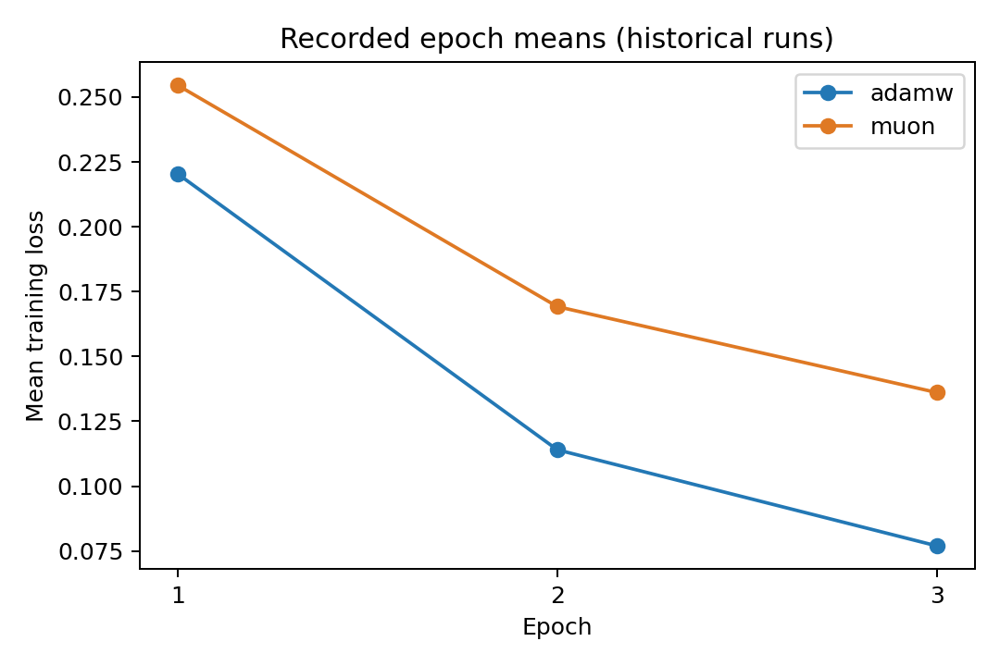
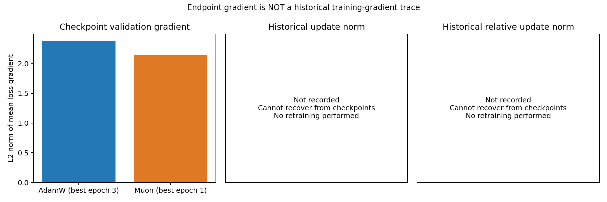
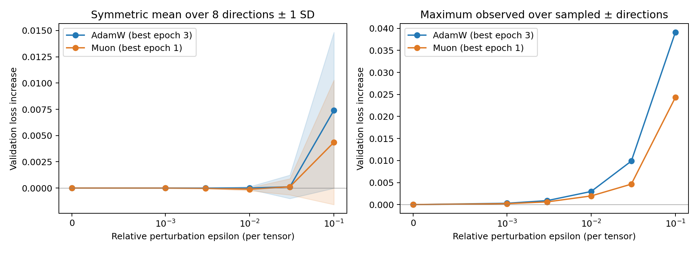

# Optimizer diagnostics and random-perturbation sharpness

Read-only analysis of the existing checkpoints completed, with **no retraining and no optimizer steps**. The original AdamW/Muon outputs and checkpoints passed SHA-256 verification. Analysis artifacts are in `outputs/diagnostics/`.

## What can be measured

Historical training recorded only epoch-average loss, not per-step gradients, parameter updates or optimizer state. Historical gradient norms, update norms and relative update norms therefore cannot be recovered. Figures explicitly mark them as missing, and JSON values are null. Differences between checkpoints cannot be treated as per-step updates.

This analysis separately computed the **gradient of the same validation-subset mean loss at each current checkpoint**, using eval mode with dropout disabled, accumulating sample-weighted gradients before computing the global L2 norm:

| Metric | Best AdamW model (epoch 3) | Best Muon model (epoch 1) |
|---|---:|---:|
| Subset loss | 0.225329 | 0.319872 |
| Subset accuracy | 89.8438% | 89.0625% |
| Validation-subset gradient norm | 2.379805 | 2.150147 |
| Global parameter norm | 416.189548 | 421.145984 |
| Historical update / relative update norm | Not recorded | Not recorded |

These gradients are not training trajectories and cannot establish which optimizer made larger updates during training. Historical epoch training losses were 0.22044 → 0.11403 → 0.07696 for AdamW and 0.25460 → 0.16923 → 0.13609 for Muon. AdamW reduced training loss more under this configuration.





## Sharpness method and results

- The same fixed 256 SST-2 validation examples, subset seed=42, batch size=32 and maximum length 128. Individual sample IDs were saved.
- 8 independent Gaussian directions, seeds=2026…2033. Both models used the same underlying directions, evaluated on both positive and negative sides.
- ε = 0, 0.001, 0.003, 0.01, 0.03, 0.1.
- For each parameter tensor, `δᵢ = ε × ||θᵢ||₂ × zᵢ / ||zᵢ||₂`. This includes embeddings, biases and LayerNorm; zero-norm tensors remain unperturbed. The same ε gives the same relative tensor perturbation scale and, ignoring rounding, the same global relative perturbation scale. This is not a fully reparameterization-invariant measure.
- Each point starts from the original weights; perturbations do not accumulate. The symmetric quantity `[L(θ+δ)+L(θ−δ)]/2 − L(θ)` reduces the influence of first-order slope. The largest observed one-sided loss increase is also recorded; it is not sharpness obtained by optimizing for the worst direction.
- After the experiment, every parameter was restored and checked against its original value, the baseline loss was verified, and disk files were confirmed unchanged.

| ε | AdamW symmetric mean Δloss | Muon symmetric mean Δloss |
|---|---:|---:|
| 0.001 | −0.00000005 | −0.00000331 |
| 0.003 | −0.00000070 | −0.00002662 |
| 0.01 | 0.00000805 | −0.00011102 |
| 0.03 | 0.00012100 | 0.00012123 |
| 0.1 | 0.00741035 | 0.00435421 |

At ε=0.1, the standard deviations across directions were 0.007425 and 0.005929, respectively. Maximum sampled one-sided Δloss values were 0.039121 and 0.024333. The mean paired difference (Muon−AdamW) was −0.003056, with an approximate 95% t interval based on 8 directions of **[−0.009764, 0.003652]**, which includes 0. This interval reflects only directional sampling variability, not dataset or training-seed uncertainty.

**Conclusion: Muon showed lower perturbation sensitivity in this sample, but the evidence is insufficient to establish that it is flatter.** At ε=0.03, the mean changes were nearly identical. Tiny negative values at smaller scales should not be interpreted as "negative sharpness" or proof of a flat minimum. This analysis evaluates validation loss, for which the checkpoints are not stationary points. Negative changes can reflect local nonconvexity, and differences near 1e-6 are also affected by FP32 numerical error.



## Limitations and proposed minimal follow-up

The checkpoints are each run's best model, but come from different epochs (3 versus 1), not equal-step endpoints. Training learning rates and effective decay also differ. Only 256 validation examples and 8 directions were sampled, which cannot cover worst-case directions in a high-dimensional space or establish that flatness causes better generalization. Lower perturbation sensitivity can coexist with Muon's lower accuracy on the original full validation set. Normalization follows the [scale-control idea in the loss-landscape literature](https://arxiv.org/abs/1712.09913), but this implementation normalizes per tensor rather than using the paper's per-filter scheme.

For future recording of actual updates, `train.py` gained an optional `--diagnostics` flag, disabled by default. It records gradients **before** optimizer.step, avoiding the reference Muon implementation's in-place gradient changes. After the step, it records actual `||θ_after−θ_before||₂` and the relative value divided by the pre-update `||θ||₂`, including weight-decay effects. Output goes to `step_diagnostics.csv` in the independent run directory. Recording adds parameter-snapshot memory and synchronization overhead. Norm arithmetic was checked using synthetic tensors, without starting model training for the test.

**Proposed minimal follow-up, not yet executed at the time of this report:** start both optimizers from the same original pretrained model, seed=42, identically initialized classification heads, and the same 1024 training examples in the same order. Run 32 steps each (64 total), batch size 32, recording loss and all three norms at every step. Keep AdamW LR=2e-5 and Muon LR=0.003/fallback=2e-5, with new output directories. This would provide a new short-run comparison, not reconstruct the original 3-epoch trajectories. Resetting momentum at an existing checkpoint must not be presented as recovering historical updates. Execution required confirmation of this plan.

## Reproduction and artifacts

```bash
PYTHONHASHSEED=42 HF_HUB_OFFLINE=1 .venv/bin/python -u analyze_checkpoints.py
```

Results already exist; add `--output-dir outputs/diagnostics_repeat` to repeat the analysis. The script refuses to overwrite an existing analysis directory. The first invocation encountered a type mismatch between a datasets Column and the tokenizer; converting it to a list resolved the issue. The hash manifest from that failed setup attempt is retained in `outputs/diagnostics_setup_attempt/`.

- `diagnostics.py`: optional per-step recording utilities.
- `analyze_checkpoints.py`: checkpoint gradients, perturbation losses, statistics and figures only.
- `outputs/diagnostics/protocol.json`: samples, random directions and perturbation definition.
- `checkpoint_gradients.json`: current validation gradients; historical updates are null.
- `sharpness_raw.csv` / `sharpness_summary.csv`: raw directional measurements and summaries.
- `paired_direction_difference.csv`: paired comparisons using matching directions.
- `training_loss.png` / `gradient_update_norms.png` / `sharpness.png`: the three figures.
- `preservation_before.json` / `verification.json`: verification of unchanged files, parameter restoration and zero optimizer steps.
