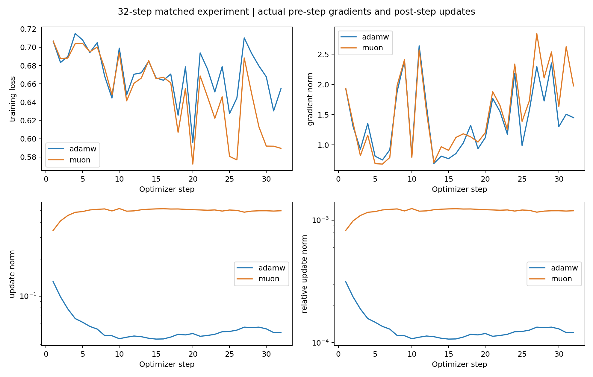
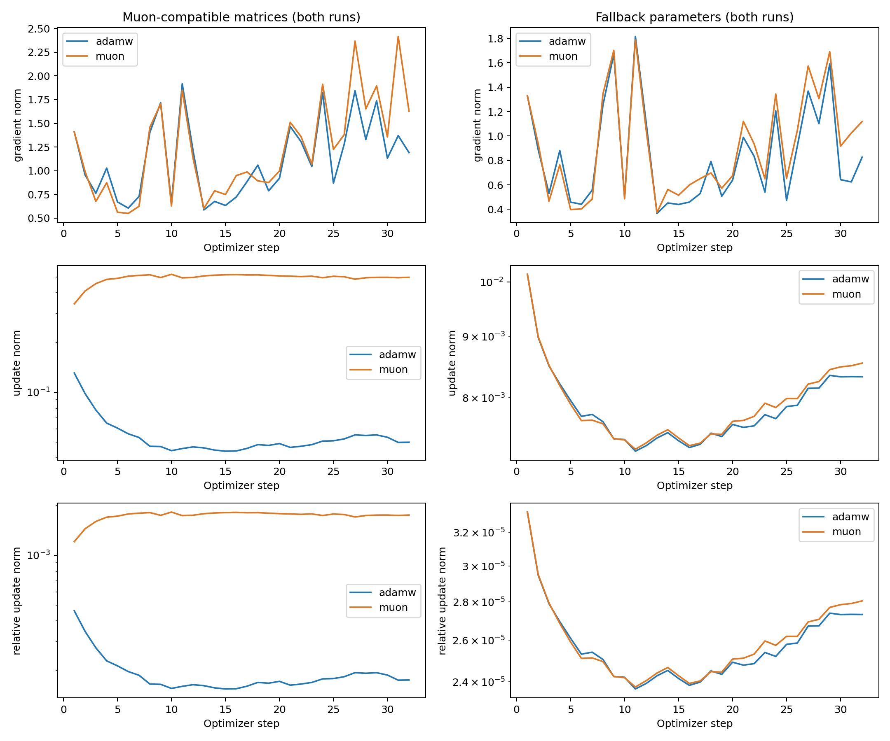

# 32-step optimizer diagnostics follow-up

AdamW and Muon each ran for exactly **32 steps**. Full training was not started, no new model checkpoint was saved, and no existing experimental output was modified. All norms were measured during this actual short run, not inferred from old checkpoints.

## Controlled conditions and measurement definitions

- Identical `distilbert-base-uncased` pretrained weights and seed=42 classification-head initialization. The complete initial state_dict SHA-256 hashes matched exactly.
- The same 1024 SST-2 training examples selected with seed=42, batch size 32 and 32 fixed batches. Per-batch tensor hashes and sample order are saved in protocol.json.
- GPU RNG states matched at every step. Both models ran in train mode with the same dropout random sequence. Maximum length 128, dynamic padding, FP32 model and MPS GPU.
- Existing `build_optimizer()` and full-run configurations: AdamW LR=2e-5; Muon LR=0.003, momentum=0.95, 5 BF16 Newton–Schulz steps; fallback AdamW LR=2e-5. Matrix weight decay=0.01, with zero decay for biases, LayerNorm and other one-dimensional parameters. AdamW betas=(0.9,0.999), eps=1e-8.
- Each step records batch-mean training loss, pre-step gradient norm, actual update norm and relative update norm.
- `update norm = ||θ_after−θ_before||₂`, including weight decay; `relative update norm = update norm / ||θ_before||₂`, using each group's own denominator.
- Gradients are recorded before Muon modifies them. Global squared norms matched the sum over the disjoint matrix/fallback partition, and all values were finite.

## Observations

The following are **arithmetic means over 32 steps**. Training loss is the online loss on successive batches, not a reevaluation of the same data after training.

| Global metric | AdamW | Muon + AdamW fallback |
|---|---:|---:|
| Training loss | 0.671843 | 0.651614 |
| Gradient norm | 1.400184 | 1.530267 |
| Update norm | 0.055392 | 0.493242 |
| Relative update norm | 0.000133 | 0.001184 |

At the first step, losses were identical (0.7067138), as were gradient norms (1.9367536), but actual update norms were 0.1310864 and 0.3432613. Thus, the optimizers already produced different updates from identical input gradients.

Mean loss over the final 8 steps was **0.663480** for AdamW and **0.610179** for Muon. Step-32 losses were 0.654780 and 0.589454, respectively. The curves show batch-to-batch fluctuations.

| Mean update for corresponding parameter groups | AdamW run | Muon run |
|---|---:|---:|
| Matrix update norm | 0.054812 | 0.493177 |
| Matrix relative update norm | 0.000193 | 0.001739 |
| Fallback update norm | 0.007859 | 0.007912 |
| Fallback relative update norm | Approximately 0.000026 | Approximately 0.000026 |

The matrix group contains the 37 hidden 2D matrices from the full Muon configuration, including pre_classifier. Both runs use the same parameter list; in the AdamW run, these matrices are still updated by AdamW. Fallback parameters include embeddings, biases, LayerNorm and the final classifier, all updated by AdamW in both runs. The CSV additionally records fallback_decay and fallback_no_decay separately.

**The main difference is in the matrix group:** Muon's mean matrix update was approximately 9 times AdamW's, while fallback updates were similar. Gradient norms did not increase proportionally, so larger gradients alone cannot explain the update difference; optimizer transformations and different learning rates both affect the updates. Muon's update magnitude rose during the first few steps and then became approximately stable, while AdamW started with a larger update that subsequently decreased.

This is a short-run observation under the predeclared configurations. Muon's lower 32-step loss does not imply better performance over the full 3 epochs. Learning rates and effective `lr×weight_decay` differ, and update magnitudes were not matched. The experiment uses only one seed and 1024 examples, includes no validation generalization measurement, and does not replace the historical full-run trajectories. Timing includes norm measurement and synchronization overhead and is not a performance benchmark.





## Execution and artifacts

Command actually executed:

```bash
PYTHONHASHSEED=42 HF_HUB_OFFLINE=1 .venv/bin/python -u run_optimizer_diagnostics.py > optimizer_diagnostics_32steps.log 2>&1
```

The script fixes the run length at 32 steps per optimizer and refuses a nonempty output directory. Results are saved in `outputs/optimizer_diagnostics_32steps/`:

- `adamw_steps.csv`, `muon_steps.csv`: raw values for each step and group.
- `all_steps.csv`: combined records, 64 steps × 5 groups = 320 rows. group=all represents the full model. The two fallback subgroups provide a decomposition and must not be counted again alongside fallback.
- `mean_summary.csv`: 32-step means for each optimizer/group.
- `global_diagnostics.png`: training loss, gradient norm, update norm and relative update norm.
- `group_diagnostics.png`: matrix/fallback gradient and update curves.
- `protocol.json`: initial model revision, full-run configurations, sample order, batch hashes and parameter-group lists.
- `verification.json`: matching initialization and per-step RNG checks, exactly 32 steps, group-norm checks and proof that earlier outputs were unchanged.
- `preservation_before.json`: SHA-256 manifest of previous experiment files.

The implementation is in `run_optimizer_diagnostics.py` and the grouped recorder added to `diagnostics.py`. The existing full-training workflow was not run.
